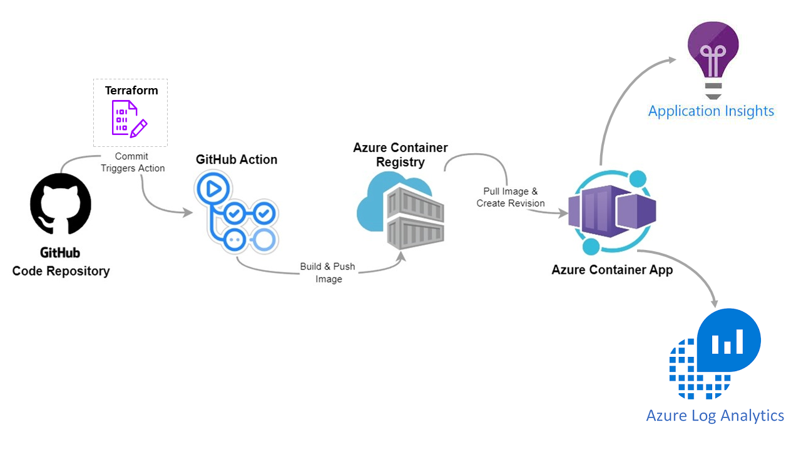

# Deploy Container App with terraform
- Setup Azure subscription and create service principal to authenticate between GitHub repo and Azure
- Prerequisites to configure terraform storage
- Use Terraform to deploy container app along with other services including Log Analytics & Application Insights
- Build and deploy example container application to Azure Container Registry
- Reviewing monitoring and alerting using Application & Container Insights

# Deployment Overview
